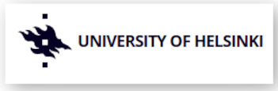

class:  center, middle, title-slide
background-image: url("Figures/LatinR_LOGOS-23.png")
background-size: 120px
background-position: 5% 5%

# Multiweb: análisis de redes ecológicas 
.pull-left[
### [Leonardo A. Saravia](https://lsaravia.github.io) 

###  [Iara D. Rodríguez](https://www.researchgate.net/profile/Iara-Rodriguez-2) 

]

.pull-right[
### [Tomás I. Marina](https://www.researchgate.net/profile/Tomas-Marina) 

###  [Susanne Kortsch](https://www.researchgate.net/profile/Susanne-Kortsch) 
]
.footnote[Slides https://ecocomplex.github.io/LatinR2022]

```{r xaringan-scribble, echo=FALSE,message=FALSE}
xaringanExtra::use_scribble()
#xaringanExtra::use_webcam()
require(igraph)
require(multiweb)
require(dplyr)
require(ggplot2)
load(".RData")

```


---
# Redes ecológicas multicapa

* El paquete estaba pensado para analizar redes con múltiples capas

.center[

]

???

* Se fue desarrollando a medida que avanzaban los trabajos del grupo de investigación

* Solamente se desarrolló con más de un tipo de interacción
 

---

class: middle, center

# Colección de 29 redes tróficas

```{r metadata, echo=FALSE,warning=FALSE,message=FALSE}


# require(ggwordcloud)
# names(metadata)
# set.seed(1)
# metadata %>% mutate(size = sample(1:1000,1)) %>%  ggplot( aes(label = Network,size=size )) +
#   geom_text_wordcloud_area(rm_outside = TRUE) +
#   scale_size_area(max_size = 20) + 
#   theme_minimal()
metadata %>% dplyr::select(-Reference) %>% head() %>%
  knitr::kable(format = "html",digits=2)

```

---
# Cálculo de propiedades topológicas

```{r, echo=TRUE, eval=TRUE,message=FALSE}
nets <- calc_topological_indices(netData)
```

```{r, echo=FALSE}
set.seed(2)
nets %>% slice_head(n=7) %>%
  knitr::kable(format = "html",digits=2)
```

---
# Cálculo de propiedades topológicas

```{r, echo=TRUE, eval=FALSE}
nets <- calc_topological_indices(netData)
```

```{r, echo=FALSE}
nets %>% slice_tail(n=7) %>% 
  knitr::kable(format = "html",digits=2)
```

---
# Red de Caleta Potter - Antártida

.pull-left[
```{r, echo=TRUE, eval=FALSE}
g <- netData[[23]] 
set.seed(2)
plot_troph_level(g,modules = FALSE)

```
]

--
.pull-right[
```{r, echo=FALSE, eval=TRUE}
g <- netData[[23]] 
set.seed(2)
plot_troph_level(g,modules = FALSE)
```
]


---
# Red de Caleta Potter - Antártida

.pull-left[
```{r, echo=TRUE, eval=FALSE}
g <- netData[[23]] 
set.seed(2)
plot_troph_level(g,modules = TRUE)
```
]

--
.pull-right[
```{r, echo=FALSE, eval=TRUE}
g <- netData[[23]] 
set.seed(2)
plot_troph_level(g,modules = TRUE)
```
]


---
# Calcular Roles Topológicos

```{r, echo=TRUE, eval=FALSE}
g <- netData[[23]] 
top_rol <- calc_topological_roles (g, nsim = 10, ncores = 4)

```
--
```{r, echo=FALSE}
top_rol %>% arrange(node) %>% slice_head(n=11) %>% 
  knitr::kable(format = "html",digits=2)
```

---
# Calcular Roles Topológicos

```{r, echo=TRUE,eval=FALSE,message=FALSE}
classify_topological_roles(top_rol,g,plt=TRUE)
```


.center[
```{r plot_toprol, echo=FALSE,message=FALSE}

classify_topological_roles(top_rol,g,plt=TRUE)
```
]
---
# Calcular Roles Topológicos

```{r, echo=TRUE,eval=FALSE,message=FALSE}
classify_topological_roles(top_rol,g,plt=TRUE)
```


.center[

]

---
# Calcular la Intensidad de Interacción

* Usamos el método de Pawar et al. 2012 "Dimensionality of consumer search space drives trophic interaction strengths" https://doi.org/10.1038/nature11131

--

* Necesitamos la masa corporal (en Kg) del depredador, la presa y  la dimensionalidad de la interacción "3D"/"2D"
--

.center[

]
---
# Calcular la Intensidad de Interacción

* Se basa en regresiones alométricas que relacionan la tasa de búsqueda y consumo con la masa corporal del depredador

--

.center[

]

---
# Calcular la Intensidad de Interacción


```{r calc_intstr, echo=TRUE,message=FALSE,eval=FALSE}
calc_interaction_intensity(web_df,res_mass, con_mass,int_dim)
```

--

```{r calc_intstr1, echo=FALSE,message=FALSE,eval=TRUE}
set.seed(1234)
web_df <- web_df %>% rename(res_mass=res.mass.mean.kg.,con_mass = con.mass.mean.kg.,int_dim = interaction.dimensionality)
calc_interaction_intensity(web_df,res_mass,con_mass,int_dim) %>% dplyr::select(c(con.taxonomy:res.taxonomy,con_mass,int_dim, mR:qRC)) %>% arrange(con_mass) %>% slice_sample(n=11) %>% mutate_if(is.numeric, ~(as.character(signif(.x, 3)))) %>% knitr::kable(format = "html")


```

---
class: inverse, center

# Mucho por hacer 

--
## Test unitarios 

--
## ¡Viñetas! 

--
##  Más soporte para las redes multiplex 

.footnote[ Repositorio https://github.com/EcoComplex/LatinR2022]

---
background-image: url(Figures/simpsons_yate.webp)
background-size: contain


class: center, top    

# ESTE NO ES EL FIN 

